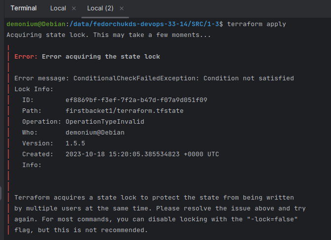

# Домашнее задание к занятию «Использование Terraform в команде»

### Задание 1

1. Возьмите код:
- из [ДЗ к лекции 4](https://github.com/netology-code/ter-homeworks/tree/main/04/src),
- из [демо к лекции 4](https://github.com/netology-code/ter-homeworks/tree/main/04/demonstration1).
2. Проверьте код с помощью tflint и checkov. Вам не нужно инициализировать этот проект.
3. Перечислите, какие **типы** ошибок обнаружены в проекте (без дублей).

### Решение 1

1. Использую код из [ДЗ к лекции 4](https://github.com/netology-code/ter-homeworks/tree/main/04/src)

Использую код из [демо к лекции 4](https://github.com/netology-code/ter-homeworks/tree/main/04/demonstration1)

2. С помощью docker контейнера tflint проверяю первый код и получаю результат:


С помощью checkov проверяю ошибки во втором коде:


3. Обнаружены следующие ошибки:

Не был инициализирован проект, соответственно нет установленного Terraform провайдера, есть объявленные, но неиспользуемые переменные, в модуле test-vm присутствует ссылка на ветку main без указания конкретного коммита. Если ветка main изменится, то после выполнения кода может быть непредсказуемый результат. 

------

### Задание 2

1. Возьмите ваш GitHub-репозиторий с **выполненным ДЗ 4** в ветке 'terraform-04' и сделайте из него ветку 'terraform-05'.
2. Повторите демонстрацию лекции: настройте YDB, S3 bucket, yandex service account, права доступа и мигрируйте state проекта в S3 с блокировками. Предоставьте скриншоты процесса в качестве ответа.
3. Закоммитьте в ветку 'terraform-05' все изменения.
4. Откройте в проекте terraform console, а в другом окне из этой же директории попробуйте запустить terraform apply.
5. Пришлите ответ об ошибке доступа к state.
6. Принудительно разблокируйте state. Пришлите команду и вывод.

### Решение 2

1. Сделал копию репозитория прошлого ДЗ.

2. Создал S3 bucket, yandex service account, назначил права доступа, YDB:


Мигрировал state проекта в S3:


3. Закоммитил изменения в ветку terraform-05.

4. Открываю terraform console, а в другом окне из этой же директории запускаю terraform apply.

5. Ответ об ошибке доступа к state:



6. Принудительно разблокирую state:


------
### Задание 3

1. Сделайте в GitHub из ветки 'terraform-05' новую ветку 'terraform-hotfix'.
2. Проверьте код с помощью tflint и checkov, исправьте все предупреждения и ошибки в 'terraform-hotfix', сделайте коммит.
3. Откройте новый pull request 'terraform-hotfix' --> 'terraform-05'. 
4. Вставьте в комментарий PR результат анализа tflint и checkov, план изменений инфраструктуры из вывода команды terraform plan.
5. Пришлите ссылку на PR для ревью. Вливать код в 'terraform-05' не нужно.

### Решение 3

1. В GitHub из ветки 'terraform-05' создал новую ветку 'terraform-hotfix'.

2. Проверил код с помощью tflint и checkov, исправил все предупреждения и ошибки в 'terraform-hotfix', сделал коммит:


3. Создал новый pull request 'terraform-hotfix' --> 'terraform-05'.

4. Добавил в него комментарий с результатом работы tflint и checkov.


------
### Задание 4

1. Напишите переменные с валидацией и протестируйте их, заполнив default верными и неверными значениями. Предоставьте скриншоты проверок из terraform console. 

- type=string, description="ip-адрес" — проверка, что значение переменной содержит верный IP-адрес с помощью функций cidrhost() или regex(). Тесты:  "192.168.0.1" и "1920.1680.0.1";
  - type=list(string), description="список ip-адресов" — проверка, что все адреса верны. Тесты:  ["192.168.0.1", "1.1.1.1", "127.0.0.1"] и ["192.168.0.1", "1.1.1.1", "1270.0.0.1"].

### Решение 4

1. Написал переменные с валидацией:


Если в адресах нет ошибок, то ```terraform console``` выведет пустой результат.

Если в адресах есть ошибки, то ```terraform console``` выведет результат валидации:


### Задание 5*
1. Напишите переменные с валидацией:
- type=string, description="любая строка" — проверка, что строка не содержит символов верхнего регистра;
- type=object — проверка, что одно из значений равно true, а второе false, т. е. не допускается false false и true true:
```
variable "in_the_end_there_can_be_only_one" {
    description="Who is better Connor or Duncan?"
    type = object({
        Dunkan = optional(bool)
        Connor = optional(bool)
    })

    default = {
        Dunkan = true
        Connor = false
    }

    validation {
        error_message = "There can be only one MacLeod"
        condition = <проверка>
    }
}
```

### Решение 5

1. Напишите переменные с валидацией:


Если в валидации нет ошибок, то ```terraform console``` выведет пустой результат.

Если в строке будут символы верхнего регистра, то увидим ошибку в ```terraform console```:


Если значение Dunkan и Connor будет true или false, то увидим ошибку в ```terraform console```:


